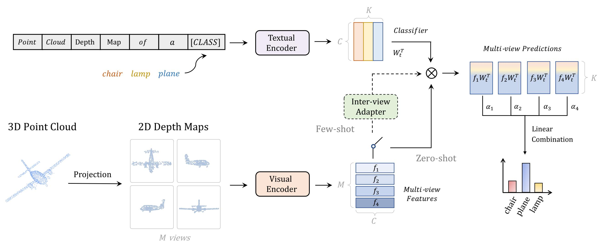
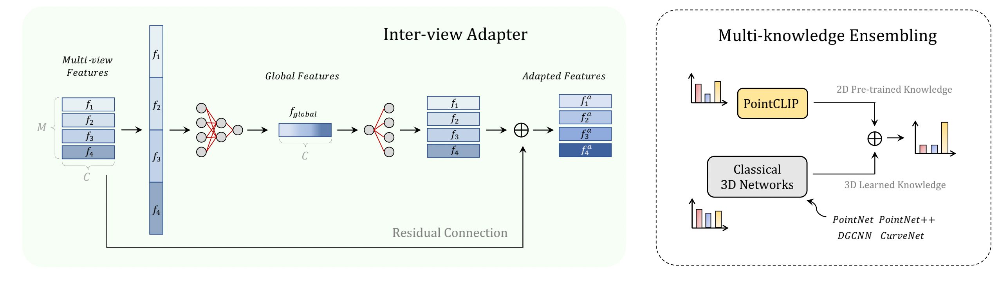

# PointCLIP: Point Cloud Understanding by CLIP
This repository is an official implementation of the paper ['PointCLIP: Point Cloud Understanding by CLIP'](https://arxiv.org/pdf/2112.02413.pdf).

## Introduction
PointCLIP firstly applys CLIP for point cloud recognition, which transfers 2D pre-trained knowledge into 3D domains. Specifically, we encode a point cloud by projecting it into multi-view depth maps without rendering, and aggregate the view-wise predictions for zero-shot classification.

  

On top of that, we design an inter-view adapter to further enhance the few-shot performance, and explore the effectiveness of muti-knowledge ensembling.

  

## Implementation
Coming soon!
