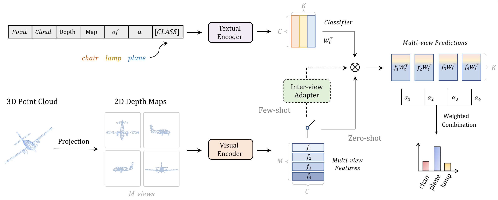

# PointCLIP: Point Cloud Understanding by CLIP
Official implementation of ['PointCLIP: Point Cloud Understanding by CLIP'](https://openaccess.thecvf.com/content/CVPR2022/papers/Zhang_PointCLIP_Point_Cloud_Understanding_by_CLIP_CVPR_2022_paper.pdf).

The paper has been accepted by **CVPR 2022**.

[PointCLIP V2](https://arxiv.org/pdf/2211.11682.pdf) with much stronger zero-shot performance will be released at [repo](https://github.com/yangyangyang127/PointCLIP_V2).

## Introduction
PointCLIP is the first to apply CLIP for point cloud recognition, which transfers 2D pre-trained knowledge into 3D domains. To achieve zero-shot classification, we encode a point cloud by projecting it onto multi-view depth maps and aggregate the view-wise prediction in an end-to-end manner. On top of that, we design an inter-view adapter to further enhance the few-shot performance, and explore the complementary property of PointCLIP for muti-knowledge ensemble.

<div align="center">
  
</div>


## Requirements

### Installation
Create a conda environment and install dependencies:
```bash
git clone https://github.com/ZrrSkywalker/PointCLIP.git
cd PointCLIP

conda create -n pointclip python=3.7
conda activate pointclip

pip install -r requirements.txt

# Install the according versions of torch and torchvision
conda install pytorch torchvision cudatoolkit

# Install the modified dassl library (no need to re-build if the source code is changed)
cd Dassl3D/
python setup.py develop

cd ..
```

### Dataset
Download the official [ModelNet40](https://shapenet.cs.stanford.edu/media/modelnet40_ply_hdf5_2048.zip) dataset and put the unzip folder under `data/`.
The directory structure should be:
```bash
│PointCLIP/
├──...
├──data/
│   ├──modelnet40_ply_hdf5_2048/
├──...
```
### 

## Get Started

### Zero-shot PointCLIP
Edit the running settings in `scripts/zeroshot.sh`, e.g. config file and output directory. Then run Zero-shot PointCLIP:
```bash
cd scripts
bash zeroshot.sh
```
If you need the post-search for the best view weights, add `--post-search` and modulate the search parameters in the config file. More search time leads to higher search results but longer time.

### Few-shot PointCLIP
Set the shot number and other settings in `scripts/fewshot.sh`. Then run PointCLIP with the inter-view adapter:
```bash
cd scripts
bash fewshot.sh
```
`--post-search` is also optional.

### Evaluation
Download the pre-pretrained [checkpoint](https://drive.google.com/file/d/1hFswVidomLdYaWZZga6RpWRJW9-JJbHZ/view?usp=sharing) by 16-shot fine-tuning and put it under `ckpt/adapter/`. It will produce 86.71% on ModelNet40 test set and 87%+ by post-search:
```bash
cd scripts
bash eval.sh
```
You can edit the `--model-dir` and `--output-dir` to evaluate checkpoints trained by your own.

## Acknowlegment
This repo benefits from [CLIP](https://github.com/openai/CLIP), [SimpleView](https://github.com/princeton-vl/SimpleView) and the excellent codebase [Dassl](https://github.com/KaiyangZhou/Dassl.pytorch). Thanks for their wonderful works.

## Citation
```bash
@article{zhang2021pointclip,
  title={PointCLIP: Point Cloud Understanding by CLIP},
  author={Zhang, Renrui and Guo, Ziyu and Zhang, Wei and Li, Kunchang and Miao, Xupeng and Cui, Bin and Qiao, Yu and Gao, Peng and Li, Hongsheng},
  journal={arXiv preprint arXiv:2112.02413},
  year={2021}
}
```

## Contact
If you have any question about this project, please feel free to contact zhangrenrui@pjlab.org.cn.

